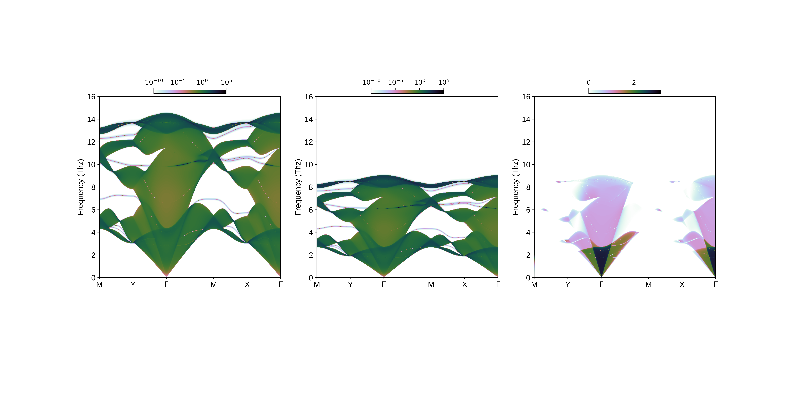

## This is the example for sdos and transmission calculation along a k-point path
1. Run the following code to generate k-point path.
```
python gen_k2d_points.py
```
2. Create ```output``` directory.

3. In config file, set path_mode = 3 to conduct transmission and surface dos calculation along given k-point path. Make sure the mass_profile.dat is correct.

4. Run
```
./phinfortran
```

5. When the calculation is done, run the following script to plot the data,
```
python plot_sdos_t.py
```
which should render this.
